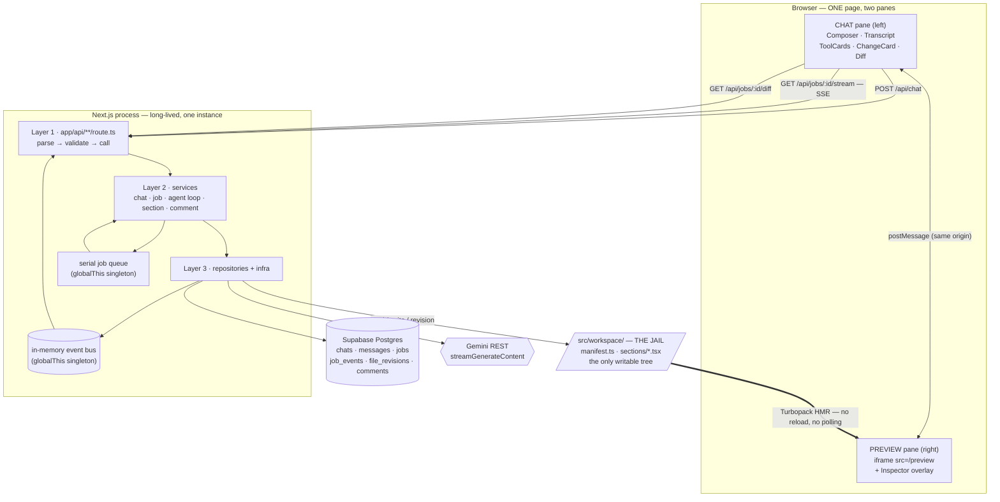
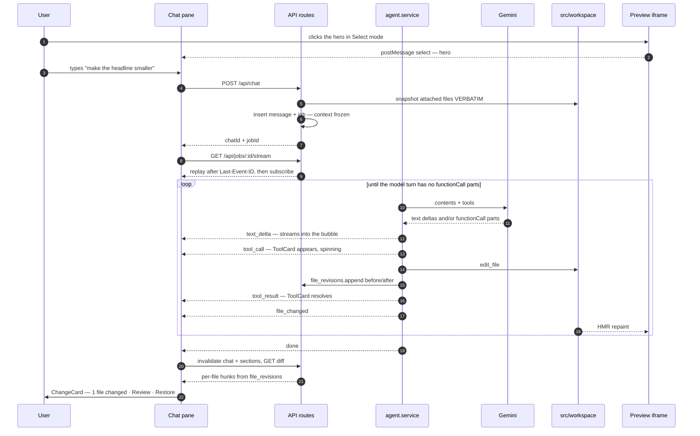
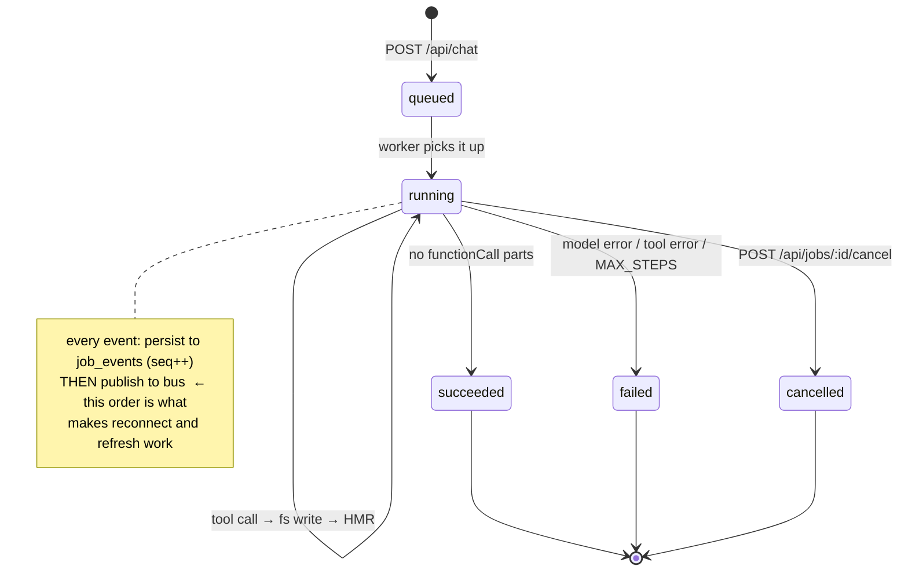

# originEd Studio — Architecture

A Lovable-style visual editor: chat on the left, live preview on the right. The agent
edits **real React source**, the preview hot-reloads, and every turn ends with a plain
summary of what changed — with the diff one click away, not in your face.

Click any section in the preview to pin it — and its **verbatim source** — into the
chat context, or leave a comment on it.

## 0. Settled stack

| Concern | Choice | Note |
|---|---|---|
| App | Next.js 16.3.3 App Router, React 19, TypeScript | one process, everything |
| Styling | Tailwind v4 + OriginKit section themes | already wired |
| Model | **Gemini via raw REST** — no SDK | `streamGenerateContent?alt=sse` |
| DB | **Supabase Postgres** via `@supabase/supabase-js` | PostgREST query builder, **no ORM** |
| Server state (client) | **TanStack Query** | snapshots only — the stream is separate |
| Live updates | **SSE** from our own route | in-memory bus + Postgres replay |
| Structure | **Three layers**, strict inward dependency | routes → services → repositories |
| Schema management | **Supabase MCP** | migrations applied directly from this session |

Installed: `@supabase/supabase-js@2.112.4`, `@supabase/ssr@0.12.5`. (npm first resolved
`supabase-js@2.109.0`, which violates `ssr`'s `^2.112.4` peer range — pinned to latest.)

---

## 1. The constraint that shapes everything

The agent writes files into `src/workspace/` and relies on Turbopack HMR to refresh
the preview. That means **a persistent filesystem and a long-lived Node process**.

Consequences, stated once so they don't surprise us later:

- **No Vercel serverless.** `POST /api/chat` returns immediately while the job keeps
  running in the background — that only works if the process outlives the response.
  Local dev, or a VM/container (Fly, Railway, a droplet).
- The in-memory event bus is **per-process**. Single instance only. Horizontal scaling
  is the point at which we'd swap it for Supabase Realtime (see §8).

---

## 2. The whole workflow

### 2.1 System map



The one edge to internalise is the thick one: **nothing pushes the new UI to the
preview.** The agent writes a `.tsx` file, Turbopack notices, and the iframe repaints
itself. We never regenerate HTML, never `postMessage` markup, never reload the frame.

### 2.2 One turn, as a sequence



### 2.3 Job lifecycle



---

## 3. Three-layer architecture

```
┌─ Layer 1 · Presentation ────────────────────────────────────────────┐
│  app/**/page.tsx · components/studio/**   (React, TanStack Query)   │
│  app/api/**/route.ts                      (parse → validate → call) │
└──────────────────────────────┬──────────────────────────────────────┘
                               │ DTOs only
┌─ Layer 2 · Domain / Services ▼──────────────────────────────────────┐
│  server/services/  chat · job · agent · section · comment · diff    │
│  business rules, orchestration, THE AGENT LOOP                      │
└──────────────────────────────┬──────────────────────────────────────┘
                               │
┌─ Layer 3 · Data access ──────▼──────────────────────────────────────┐
│  server/repositories/  job · message · event · comment · revision   │
│  server/infra/  gemini.client · sse.parse · workspace.fs · bus      │
└─────────────────────────────────────────────────────────────────────┘
```

**The dependency rule — one direction only.** An inner layer never imports an outer one.

- A route handler **never** writes `supabase.from(...)`. It calls a service.
- A service **never** calls `fetch()` to Gemini. It calls `infra/gemini`.
- **Only repositories** build PostgREST queries. If you need a new query, it gets a
  named method on a repository — not an inline `.from().select()` at a call site.
- Services take repositories as plain module imports (no DI container; this is a
  small app). Swappability comes from the boundary being narrow, not from indirection.

---

## 4. Directory layout

Two **root layouts**, split by route group. This is the mechanism behind §10's CSS
isolation: the studio's Tailwind build and the workspace's OriginKit `@theme` tokens
are compiled into separate stylesheets that never meet. (Next only allows one root
layout per group, and no top-level `layout.tsx`.)

```
src/
  app/
    (studio)/                    ◀ ROOT LAYOUT 1 — the editor
      layout.tsx                   html/body, Geist, Providers
      studio.css                   tailwind + oe-* design tokens ONLY
      page.tsx                     "/" → <StudioShell/>
      providers.tsx                QueryClientProvider
    (preview)/                   ◀ ROOT LAYOUT 2 — the user's page
      layout.tsx                   html/body, mounts <Inspector/>
      preview.css                  tailwind + originkit themes + inspector chrome
      originkit-section-theme{,s}.css
      _runtime/Inspector.tsx       postMessage bridge — OUTSIDE the jail on purpose
      _runtime/dom.ts              attributes, pin markers, flash — the DOM half
      _runtime/PreviewErrorBoundary.tsx  a throwing section, reported not swallowed
      _runtime/SectionBoundary.tsx   data-section-* attributes — OUTSIDE the jail
      preview/page.tsx             "/preview" → <WorkspacePage/>
    api/
      _lib/http.ts                 parseBody · handle · HttpError (private folder)
      chat/route.ts                POST → create job
      chats/[id]/route.ts          GET  → transcript snapshot
      jobs/[id]/stream/route.ts    GET  → SSE
      jobs/[id]/cancel/route.ts    POST → abort the running job
      jobs/[id]/diff/route.ts      GET  → per-file hunks   ◀ change review
      jobs/[id]/undo/route.ts       POST → replay the job backwards
      comments/route.ts             GET  → open notes · POST → leave one  ◀ notes
      comments/[id]/resolve/route.ts POST → close one by hand
  components/studio/
    StudioShell.tsx                the split layout + mode state + the §13 seam
    chat/                          Transcript · Composer · ContextChip
                                   MessageBubble · ToolCard
                                   ChangeCard · DiffView    ◀ change review
                                   CommentThread            ◀ notes
                                   BuildErrorCard           ◀ a broken preview
    preview/                       PreviewCanvas · PreviewToolbar · StatusPill
                                   viewport.ts (device presets)
  hooks/                           usePreviewBridge
                                   usePins  toggle / add / keep / reconcile / payload
                                   useComments  query + the badge/hydration maths
                                   useChat (query + send mutation)
                                   useJobStream (EventSource + pure reducer)
                                   useJobDiff
  lib/
    api/client.ts                  typed fetch client (browser → our routes)
    query-client.ts · types.ts     shared DTOs + the SSE event union
  server/
    services/                      chat · job · agent · section · comment · diff
                                   job-emitter  seq + persist-before-fanout (§8)
                                   stream.service  replay (flush-then-query) + subscribe
                                   agent.service  the real Gemini loop (§6)
                                   agent.prompt   system prompt + verbatim context
                                   agent.tools    declarations + executor + revisions
                                   section.codegen  add/remove a section, purely (§7)
                                   agent.script  the Phase 2 token-free stand-in
    repositories/                  supabase · chat · message · job · event
                                   revision · comment
    infra/                         workspace.fs · event-bus · job-queue
                                   sse.format  (ours, out) · sse.parse (Gemini, in)
                                   gemini.client
                                   typecheck  tsc over the jail, parsed (§7)
                                   catalog.fs  reads a section template, read-only
  utils/supabase/                  client · server · admin
  catalog/                    ◀──── section templates the agent can add (§7)
    catalog.ts                     id · name · description · tags — PURE DATA
    sections/*.tsx                 real components, compiled and Tailwind-scanned
                                   in place, with __NAME__/__LABEL__ substituted
                                   on the way into the jail
  workspace/                  ◀──── JAIL ROOT: the only writable tree
                              (tsconfig.workspace.json at the repo root scopes
                               the agent's type check to exactly this tree)
    manifest.ts                    ordered section list — PURE DATA, no React
    page.tsx                       manifest → typed registry → <SectionBoundary>
    sections/hero.tsx              the real 448-line markup, not a wrapper
    sections/features.tsx          plain, hand-written, and deliberately SECOND
    components/originkit/          hero-16 sub-components (see §11)
```

### Three decisions worth recording

**`manifest.ts` carries no React.** The server needs `slugForFile()` to label the
ChangeCard (§12), and a route handler should not drag a client component graph in to
get it. `page.tsx` holds the components in a registry typed
`Record<SectionSlug, ComponentType>` — so adding a manifest entry without adding the
import is a **type error**, which the agent's own `typecheck` tool catches inside the
same job instead of the section silently vanishing.

**`Inspector` is outside the jail, `SectionBoundary` is inside.** The boundary is part
of the page and the agent composes with it. The Inspector is the lens the user watches
through, and the agent must not be able to edit the instrument it is being observed with.

**There is no `proxy.ts`.** Next 16 renamed Middleware to Proxy, and the usual Supabase
middleware exists only to refresh auth sessions. v1 has no auth, so it would be dead
code with a live-looking name. `utils/supabase/server.ts` is kept for when that changes.

**The job queue is serial, and that is a correctness property.** From Phase 3 the
worker writes into `src/workspace/`; two agents editing the same tree at once would
interleave their reads and writes into nonsense. A queue depth of one is the correct
amount of concurrency for a single-user local studio. It lives on `globalThis` for the
same reason the bus does.

**`agent.script.ts` outlives Phase 2.** It is a deterministic agent that emits every
variant of the event union at realistic pacing, which makes it the fixture for testing
anything downstream of the loop without a network call or a token. Phase 3 replaces the
body of `agent.service.run`, not this file.

## 5. One chat turn, end to end

```
 1  Composer sends { text, attachments:[{sectionSlug}] }
 2  POST /api/chat
      ├─ zod-validates the body
      ├─ chat.service.send()
      │    ├─ section.service.snapshot()  ── reads each attached file VERBATIM
      │    ├─ message.repo.insert(user turn)
      │    └─ job.repo.insert({status:'queued', prompt, context})   ← snapshot frozen here
      └─ returns { chatId, jobId }              (immediately — does not await the agent)
 3  jobQueue.enqueue(jobId)   → serial worker, one job at a time
 4  Browser opens EventSource GET /api/jobs/{jobId}/stream
      ├─ event.repo.listAfter(jobId, lastEventId)   ── replay
      └─ bus.subscribe(jobId)                        ── live
 5  agent.service.run()  ── the loop in §6
      every event:  event.repo.append(seq++)   then   bus.publish()
      every write:  revision.repo.append(before/after)  → diff + undo
 6  Agent writes src/workspace/sections/hero.tsx
      → Turbopack HMR → the /preview iframe repaints. No reload, no polling.
 7  'done' event → useJobStream invalidates ['chat', chatId] and ['sections'],
      and fetches ['diff', jobId] → ChangeCard renders under the last message
```

Step 2's snapshot is the important one: **attachments resolve at job-creation time**,
so the context is exactly the bytes the user was looking at — not whatever the file
says by the time the agent gets around to reading it. (Verified end to end: the
`jobs.context` row for a pinned Hero holds 19,777 bytes of `hero.tsx`, frozen.)

Built with the job inserted *before* the message, not after as listed above, so the
user turn can carry `job_id` on the way in instead of needing a follow-up UPDATE to
link them. The freeze happens before either write, so the guarantee is untouched.

---

## 6. The agent loop

Raw REST, no SDK. `POST https://generativelanguage.googleapis.com/v1beta/models/{model}:streamGenerateContent?alt=sse`
with `x-goog-api-key` as a **header** (not `?key=`, which leaks into logs).

### Request body

```json
{
  "systemInstruction": { "parts": [{ "text": "<agent system prompt>" }] },
  "contents": [
    { "role": "user",  "parts": [{ "text": "<attached sections> + <user text>" }] },
    { "role": "model", "parts": [{ "functionCall": { "name": "read_file", "args": { "path": "sections/hero.tsx" } } }] },
    { "role": "user",  "parts": [{ "functionResponse": { "name": "read_file", "response": { "content": "..." } } }] }
  ],
  "tools": [{ "functionDeclarations": [ { "name": "...", "description": "...", "parameters": { "type": "object", ... } } ] }],
  "toolConfig": { "functionCallingConfig": { "mode": "AUTO" } },
  "generationConfig": { "maxOutputTokens": 65536 }
}
```

### The loop

```ts
// server/services/agent.service.ts
export async function run(job: Job, emit: Emit, signal: AbortSignal) {
  const contents = await buildInitialContents(job);   // history + frozen attachments
  let step = 0;

  while (step++ < MAX_STEPS) {
    const turn = await streamTurn({ contents, emit, signal });
    contents.push({ role: "model", parts: turn.parts });

    const calls = turn.parts.flatMap(p => p.functionCall ? [p.functionCall] : []);
    if (calls.length === 0) {                         // ◀ the only exit condition
      if (await gate()) continue;                     // §7 — does it still compile?
      break;
    }

    const responses: Part[] = [];
    for (const call of calls) {                       // sequential — they share one fs
      emit("tool_call", { name: call.name, args: call.args });
      const r = await executeTool(job, call, signal);
      emit("tool_result", { name: call.name, ok: r.ok, summary: r.summary });
      responses.push({ functionResponse: { name: call.name, response: r.payload } });
    }
    contents.push({ role: "user", parts: responses }); // ALL results in ONE turn
  }
}
```

### Six things that differ from a Claude-shaped loop

Items 1–5 were written from the docs and all held up. **Item 6 was not in this
document and is the one that actually breaks the loop**, so it is stated loudest.

1. **There is no `stop_reason: "tool_use"`.** The loop condition is simply *did this
   model turn contain any `functionCall` parts*. `finishReason: "STOP"` shows up on
   tool-calling turns too — do not branch on it. ✅ confirmed live: every tool-calling
   turn in the Phase 3 runs reported `STOP`.
2. **Streamed text arrives fragmented across chunks and must be accumulated.** Each SSE
   chunk is a partial `GenerateContentResponse`. Emit each fragment to the client
   immediately, but coalesce them into **one** text part before pushing the model turn
   back into `contents`. Pushing one part per fragment produces a bloated, malformed turn.
3. **`functionResponse.response` must be a JSON object**, never a bare string. Wrap:
   `{ "content": "..." }` on success, `{ "error": "..." }` on failure. ✅ confirmed —
   a bare string is `400 Invalid value at ...function_response.response`.
4. **Roles are `user` / `model`** — and tool results go back under role **`user`**.
5. **Parallel calls** — a turn may hold several `functionCall` parts. Execute all,
   return all `functionResponse` parts in a **single** user turn. Splitting them across
   turns teaches the model to stop batching.
6. **`thoughtSignature` is mandatory on the way back, and it is what makes rule 2
   dangerous.** Gemini 3.x attaches an opaque `thoughtSignature` to parts it emits.
   Echo a `functionCall` part back without it and the NEXT request dies:

   > `400 Function call is missing a thought_signature in functionCall parts.`

   The trap is that rule 2 tells you to rebuild the model turn — and the obvious
   rebuild (`{ text: allFragments.join("") }`) throws the signature away. The failure
   surfaces one turn *after* the mistake, so it reads like a context bug, not a
   serialisation bug. `mergeParts` therefore coalesces text **only** into a part with
   no signature of its own; a signature-bearing part is indivisible. Nine unit tests
   pin this, because nothing about it is visible from reading the loop.

`functionCall` also carries an `id` (`call_3032655`). Passing it back is optional —
verified, it works without — but the client keys ToolCards on it, so it is used.

### SSE parsing (`infra/sse.parse.ts`)

~~Read `res.body` with a `TextDecoder`, buffer, split on `\n\n`~~ — **wrong, and
silently so.** Gemini terminates frames with **`\r\n\r\n`**. Splitting on `\n\n`
matches nothing, so a perfectly good `200` yields **zero events** and the agent
appears to return an empty reply. Normalise `\r\n` → `\n` on the way in.

Two further hazards, both found by tests rather than by the live run:

- **A chunk boundary can land between the `\r` and the `\n`.** Normalising each
  chunk in isolation lets that terminator through unconverted and swallows the
  following frame. The parser holds a trailing `\r` back until the next chunk.
- **The last frame may arrive with no trailing blank line.** `end()` yields it
  rather than dropping it.

That is still the entire cost of dropping the SDK — it is just 90 lines, not 25.

### Model

`GEMINI_MODEL` env var. Default **`gemini-3.7-flash`** ✅ — confirmed available and
used for every Phase 3 run. **`gemini-3.1-pro-preview`** is the escalation for hard
edits. Flip via env, no code change.

**`thinkingConfig` shape, resolved.** `generationConfig.thinkingConfig.thinkingLevel`
takes `"low"` or `"high"`. `thinkingLevel` at the top level of `generationConfig` is a
400 (`Unknown name "thinkingLevel"`), and the 2.x `thinkingBudget: 0` still works.
Thinking is **on by default and not cheap** — an unconfigured "say hi in 3 words"
burned 261 thought tokens. We send `thinkingLevel: "low"`, overridable with
`GEMINI_THINKING_LEVEL`.

---

## 7. Tools and the jail

| Tool | Args | Notes |
|---|---|---|
| `list_files` | `{ dir? }` | relative to jail root | ✅ |
| `read_file` | `{ path }` | | ✅ |
| `write_file` | `{ path, content }` | new file / full rewrite; a no-op write records no revision | ✅ |
| `edit_file` | `{ path, old_string, new_string, replace_all? }` | exact match; **errors on 0 or >1 hit** — forces read-before-write and keeps diffs small | ✅ |
| `delete_file` | `{ path }` | | ✅ |
| `list_sections` | `{}` | reads `manifest.ts` | ✅ |
| `list_templates` | `{}` | the section catalog: id, name, description, tags | ✅ |
| `add_section` | `{ slug, label?, template?, after?, before? }` | one call, three files — see below | ✅ |
| `remove_section` | `{ slug }` | un-wires, then deletes | ✅ |
| `reorder_sections` | | **still dropped.** Re-ordering is one edit to one array in a file the model has already read; a tool would be a second way to write the same bytes. |
| `typecheck` | `{}` | `tsc --noEmit` scoped to the jail by `tsconfig.workspace.json` (~0.55s, vs ~2.8s for the project) | ✅ |


### The gate: the loop checks its own work

The model saying "done" is evidence that it *thinks* the page still compiles, not
that it does. So when a turn ends with no tool call and something has been written,
the loop runs the type check itself and hands any errors back:

```
edit_file → … → model stops talking → typecheck ✗ → "these errors are in the
workspace right now, fix them" → model reads, edits → typecheck ✓ → done
```

Four decisions, three of which only became obvious once it ran:

- **The paths are jail-relative.** `tsc` reports `src/workspace/sections/hero.tsx`;
  every other tool speaks `sections/hero.tsx`. Handing the model a path it cannot
  pass to `read_file` turns a fix into a guess.
- **A checker that could not run is OUR problem.** A missing binary comes back as
  `{ error }`, never as "no errors" — reporting a broken toolchain as a clean
  workspace is the one lie here that actually costs something, because the model
  would stop.
- **The gate is a backstop, not the mechanism.** Told that the workspace is checked
  automatically, the model calls `typecheck` *itself* anyway — it did in two of the
  four live runs, and in one of them its own call is what caught the planted error.
  That is the cheaper order: fixing inside its own turn costs no extra round trip.
  So the gate skips when nothing has been written since the last passing check,
  whoever ran it.
- **A repair round pays for the whole context again.** The live run that needed one
  cost **49.5k tokens** against 15k, 14k and 4.4k for the runs that didn't. Hence
  `MAX_REPAIRS = 2`: a model that cannot fix its own compile error in two goes is
  usually making it worse, expensively.

The gate checks the **whole workspace**, not just the files this job touched. That
means it can hand the model an error somebody else left behind — deliberate, because
a job can break a file it never opened (editing `manifest.ts` breaks `page.tsx`), and
filtering by touched files would miss exactly that. The instruction is phrased "these
errors are in the workspace right now" rather than "you broke this". Recorded as
risk 14.

**Two ceilings, for two different runaways.** `AGENT_MAX_STEPS` (12) bounds a model
stuck in a read/edit/read cycle. `AGENT_MAX_TOKENS` (250k) bounds the other one:
context grows with every turn, so a job can be cheap per step and ruinous in total
(§14 risk 8). The token check runs **before** each request, so the loop never spends
money on a turn it has already decided it cannot afford — and the tools of the last
affordable turn still run, because abandoning a call already paid for throws away
what it bought.

**A tool the model used wrong is not a job failure.** A bad path, a stale
`old_string`, a jail escape, a non-string argument — all come back as
`{ error: "..." }` inside the `functionResponse`, so the model reads the message and
retries within the same job. Only an unreachable Postgres or a broken jail throws and
fails the job. Getting this backwards makes the agent brittle in exactly the situation
it should handle best: its own near-miss.

The error strings are written **for the model**, not for a log — `old_string was not
found in X. Read the file again and copy the text exactly, including indentation.`
tells it what to do next; `ENOENT` does not.

### Adding a section: one call, three files

The table above used to say `add_section` was dropped, on the grounds that adding
a section is three edits to files already in the jail and a tool would be a
fourth way to write the same bytes. That was right until Phase 7 priced the
failure. The manifest and the registry have to agree or `page.tsx` does not
compile; the model can get that right, it just has to get it right three times in
a row, from memory, with exact-match edits — and the round trip when it does not
is **49.5k tokens**. The tool does not make the edits easier. It makes the
mistake impossible.

```
add_section { slug: "pricing", template: "pricing", after: "hero" }
  → sections/pricing.tsx   created from the template   ┐
  → manifest.ts            entry inserted after hero   ├ three revisions,
  → page.tsx               import + registry entry     ┘ three ChangeCard rows
```

Four things that are not obvious:

- **Everything that can fail, fails before the first write.** The template is
  read, both files are read, and both transforms run — all of it pure — before
  anything is written. A duplicate slug or an unknown template leaves the
  workspace untouched, because half an added section (a file with no manifest
  entry, or worse, an entry with no file) is a broken page, and Turbopack
  recompiles between each of those writes.
- **The order is not arbitrary.** Add writes the section file first, so no
  intermediate state references a file that is not there. Remove un-wires first
  and deletes last, for the same reason in reverse.
- **The transforms are line-based, and pure** (`section.codegen.ts`). Not an AST
  pass: these are two files this project maintains by hand and the agent is told
  not to reformat, so a shape we do not recognise has to fail loudly with "edit
  it with edit_file instead" rather than be silently re-serialised. Being pure is
  what makes the edge cases — an empty manifest, a hyphenated slug that is not a
  valid object key, a component name already imported — reachable in a unit test
  instead of only in a paid run.
- **`add_section` knows the slug; `slugForFile` does not.** The server's imported
  copy of `manifest.ts` is stale for a section created by this very job (risk 9),
  so the slug is passed down to the revision record rather than looked up. That
  is the difference between "Pricing" and a bare path on the ChangeCard.

### The catalog

`src/catalog/sections/*.tsx` are **real components**, not string literals, and
that is the whole design:

- `tsc --noEmit` proves every template compiles before it can ever land in
  someone's page.
- Tailwind's source detection scans them, so the classes a template needs are
  already in the preview stylesheet the moment it arrives.
- Two tokens, `__NAME__` and `__LABEL__`, are substituted on the way in. Both are
  valid where they sit — `__NAME__` is a legal identifier — so the template file
  still parses in place. That is not a trick to be clever with; it is the reason
  the first two properties hold.

A template imports nothing, asserted in `catalog.test.ts`. There is no module
graph on the far side of the copy: `sections/<slug>.tsx` lands in a jail that
cannot see `src/catalog`, and an import that does not resolve there is a broken
preview from a section the user never wrote.

§7 planned `search_originkit` / `add_originkit` as shells around the OriginKit
CLI. There is no CLI in this repo — OriginKit arrived in Phase 1 as vendored
source, and the hero's sub-components are the only trace of it. So the catalog is
local, which turns out to be the better shape anyway: a template is a file this
project compiles, not a package it downloads.

```ts
// server/infra/workspace.fs.ts
const ROOT = path.resolve(process.cwd(), "src/workspace");
export function resolveInWorkspace(rel: string) {
  const p = path.resolve(ROOT, rel);
  if (p !== ROOT && !p.startsWith(ROOT + path.sep)) throw new WorkspaceError("escapes workspace");
  return p;
}
```
Plus `lstat` symlink rejection, an extension allowlist (`.tsx .ts .css .json .md`), and
a 256KB content cap. Unit-tested against `../`, absolute paths, and symlinks **before**
any tool ships.

Every mutating tool appends `{job_id, seq, path, op, before, after}` to `file_revisions`.
That one table is the source for **both** the diff view (§12) and undo — no git, no
re-reading the filesystem.

---

## 8. Streaming

**Persist first, then fan out.** Every event is appended to `job_events` with a
monotonic `seq`, then published to an in-memory bus. That ordering buys
reconnect, refresh-durability, and multi-tab.

**Correction, from building it: the SSE handler must SUBSCRIBE FIRST, then
replay.** The original order here — replay, then subscribe — has a hole in the
middle. Anything published between the query returning and the subscription
being registered is lost forever: the query already missed it, and the listener
did not exist yet. The handler subscribes into a buffer, replays
`seq > Last-Event-ID`, then drains the buffer discarding anything at or below
the last seq it sent.

```
event: status         data: {"status":"running"}
event: text_delta     data: {"text":"…"}
event: tool_call      data: {"name":"edit_file","args":{…}}
event: tool_result    data: {"name":"edit_file","ok":true,"summary":"1 hunk"}
event: file_changed   data: {"path":"sections/hero.tsx","op":"update","sectionSlug":"hero"}
event: usage          data: {"promptTokenCount":…,"candidatesTokenCount":…}
event: error          data: {"message":"…"}
event: done           data: {"status":"succeeded","filesChanged":1}
id: <seq>
```

`data` also carries its own `type` field, so the client has one parser rather
than eight, and a frame is self-describing if it is ever logged or replayed out
of band. A synthetic frame — the `done` the route fabricates for a job that died
without emitting one — is sent with **no `id:` line**, so it cannot move the
browser's `Last-Event-ID` and corrupt the next resume.

Route requirements — omit any one and it works locally, then hangs behind a proxy:

```ts
export const runtime  = "nodejs";
export const dynamic  = "force-dynamic";
// Content-Type: text/event-stream · Cache-Control: no-cache, no-transform
// Connection: keep-alive · X-Accel-Buffering: no · ": ping\n\n" every 15s
```

**Coalesce writes.** Push raw `text_delta` to the bus instantly, but batch them into
`job_events` on a ~250ms flush. One row per token is hundreds of round-trips to
Supabase per job.

**Coalescing breaks replay unless you flush before serving one.** These two rules
fight: "everything is persisted before it is published" and "text is published
before it is persisted" cannot both hold. An end-to-end run caught the
consequence — a client that dropped at `seq` 6 and reconnected mid-job resumed at
`seq` 12, because deltas 7–11 had gone out on the bus and were still sitting in
the 250ms buffer where the replay query could not see them. Silent, and in the
middle of a sentence.

The fix is one call, not a redesign: live emitters register themselves in a
`globalThis` map by job id, and `stream.service.replay()` flushes the running
job's pending batch *before* it queries. The invariant becomes "everything
published so far is persisted **at the moment a replay reads**", which is the
only moment it has to be true. A job that has already finished is a no-op —
`dispose` flushed it.

**Measured, on a real job against hosted Supabase** — 41 events, median gap between
consecutive events by type:

| event | median gap | what it costs |
|---|---|---|
| `text_delta` | **25 ms** | nothing — scripted pacing is 24 ms, so the DB is off this path entirely |
| `tool_call` | 263 ms | one insert round trip |
| `tool_result` | 507 ms | one insert round trip |
| `file_changed` | 173 ms | one insert round trip |
| `done` | 418 ms | one insert round trip |

The token path is free and the checkpoint path costs one Supabase round trip —
which is the coalescing design doing exactly what it was for. Getting there needed
one fix: a checkpoint used to *flush* pending text and *then* append itself, two
round trips. Pending text now rides along inside the checkpoint's own insert, which
took `tool_call` from 397 ms to 263 ms and the whole job from 3.4 s to 3.0 s. The
ordering guarantee is unchanged — same single write, same seq order.

Worth carrying into Phase 3: a ToolCard lags reality by a DB round trip, ~200–500 ms.
Against real model latency that disappears. It would only matter if checkpoints ever
became chatty, and the fix then is the same trick applied harder — batch them.

*Why not Supabase Realtime?* It would remove the in-memory bus (the only thing blocking
multi-instance). But every token would round-trip through Postgres before reaching the
browser, which is the wrong latency for token streaming. SSE now; Realtime is the
scale-out swap, and it only touches `infra/event-bus.ts`.

---

## 9. Data model

`manifest.ts` stays the source of truth for sections — the agent edits it directly, so
there is no `sections` table to keep in sync. Comments reference `section_slug`.

```sql
create table chats (
  id uuid primary key default gen_random_uuid(),
  title text, created_at timestamptz not null default now());

create table messages (
  id uuid primary key default gen_random_uuid(),
  chat_id uuid not null references chats(id) on delete cascade,
  role text not null check (role in ('user','model')),
  content jsonb not null, job_id uuid,
  created_at timestamptz not null default now());

create table jobs (
  id uuid primary key default gen_random_uuid(),
  chat_id uuid not null references chats(id) on delete cascade,
  status text not null default 'queued'
    check (status in ('queued','running','succeeded','failed','cancelled')),
  prompt text not null,
  context jsonb,                                   -- frozen attachment snapshot
  error text,
  created_at timestamptz not null default now(),
  started_at timestamptz, finished_at timestamptz);

create table job_events (
  id bigserial primary key,
  job_id uuid not null references jobs(id) on delete cascade,
  seq int not null, type text not null, data jsonb,
  created_at timestamptz not null default now(),
  unique (job_id, seq));
create index on job_events (job_id, seq);

create table file_revisions (
  id bigserial primary key,
  job_id uuid not null references jobs(id) on delete cascade,
  seq int not null, path text not null,
  op text not null check (op in ('create','update','delete')),
  before text, after text,
  reverted_at timestamptz,
  created_at timestamptz not null default now());
create index on file_revisions (job_id, seq);

create table comments (
  id uuid primary key default gen_random_uuid(),
  section_slug text not null, body text not null,
  status text not null default 'open' check (status in ('open','resolved')),
  job_id uuid, created_at timestamptz not null default now(), resolved_at timestamptz,
  -- Which element inside the section, when the note is on one (§11). All three
  -- nullable and nothing backfilled: `target_key is null` IS the section note,
  -- which is what every row written before this already was.
  target_key text, target_ref jsonb, target_label text);
create index comments_open_section_idx on comments (section_slug, status);
```

**RLS: on for every table, with no policies.** v1 has no auth, so the browser's
publishable key must reach nothing. All access goes through our routes using the
**secret key** in `utils/supabase/admin.ts`, which is imported only from Layer 3.

Applied via **Supabase MCP** (`apply_migration`) — one migration per phase, versioned in
the project, no SQL-editor copy-paste.

---

## 10. The studio shell

**One route.** `/` renders both panes. The right pane is an `<iframe src="/preview">` —
same app, same origin, different route.

The layout follows the shape Lovable settled on — conversation left, live page right,
controls floating over the page rather than around it — because it is the shape the
work actually has. The visual language is ours.

```
┌────────────────────────────────────────────────────────────────────────────┐
│ ◆ originEd │ Working… 12s              ⧉ Landing ▾      ● 240ms   ⟳       │ 44px
├──────────────────────────┬─────────────────────────────────────────────────┤
│  CHAT              33%   ┊  CANVAS                                   67%   │
│                          ┊    ┌───────────────────────────────────────┐    │
│                    ┌───┐ ┊    │                                       │    │
│              ⧉ Hero│   │ ┊    │  the page, as a card:                 │    │
│   make the headline│   │ ┊    │  rounded-xl · ring-white/10 · shadow  │    │
│                    └───┘ ┊    │  width driven by the viewport switch  │    │
│                          ┊    │                                       │    │
│  ◆ ORIGINED              ┊    │                                       │    │
│    ┌ ✓ Edit  hero.tsx ┐  ┊    │                                       │    │
│    └──────────────────┘  ┊    └───────────────────────────────────────┘    │
│    Updated the headline. ┊                                                 │
│                          ┊         ╭─────────────────────────────╮         │
│  ┌────────────────────┐  ┊         │ ▸ Browse  ⊹ Select │ ▭ ▯ ▮  │ floating│
│  │ ⧉ Hero ×           │  ┊         ╰─────────────────────────────╯ toolbar │
│  │ Describe a change… │  ┊                                                 │
│  │ 1 pinned        ↑  │  ┊                                                 │
│  └────────────────────┘  ┊                                                 │
└──────────────────────────┴─────────────────────────────────────────────────┘
                           ↑ drag to resize · double-click to reset
```

### Proportions

**22 / 78, draggable between 18% and 44%.** The page under edit IS the work; the
conversation is the instrument you hold while doing it. This started at 33/67 and was
narrowed after the first real look at the running tool: a chat column at a third of the
screen makes the product read as a chatbot that happens to render a preview, which is
backwards. The old design before that pinned chat at a fixed `400px`, which is the same
width on a 13" laptop and a 32" display — wrong on both.

The width is **not persisted**. Restoring a stored value means either a hydration
mismatch on a server-rendered `style` attribute or a `setState` inside an effect, and
double-click-to-reset covers what persistence was for. A real preference store is a
Phase 8+ concern, not a reason to take a correctness hit now.

### The toolbar docks above the frame

Modes and the viewport switcher live on the **preview pane's own bar**, directly above
the page — near the thing they act on, which is most of what makes a canvas tool feel
direct, while the app's top bar keeps only what is true of the project as a whole.

They spent one iteration as a bottom-centre floating pill. That is the house style of
every generated builder, and it had a concrete cost as well as a stylistic one: it sat
*on top of* the page's footer, so the bottom ~64px of the thing being edited were
permanently behind a control bar.

| Mode | iframe behaves like | Inspector | Key |
|---|---|---|---|
| **Browse** | a normal site — links, forms, the hero canvas all work | markers live, nothing else | `B` |
| **Select** | a canvas — pointer events captured, nothing navigates | hover outlines; click pins, drag selects | `S` |

**Select is the default.** Pointing at the page is what this tool is for, and a mode you
have to find and arm before the headline feature does anything is a mode most people
never find. Browse is one key away and `Esc` always lands there.

There is deliberately no Comment mode. A note is written where the selection is made —
in the popup the drag opens — or in the composer against a pinned section.

`Esc` leaves Select. The shortcut handler ignores keystrokes whose target is an input,
textarea or contenteditable — otherwise typing the word "select" changes modes four times.

### One page at a time

The workspace is a flat list of sections, but the site it renders is not. `hero` and
`features` are one landing page; `hero-08` is a different design that arrived through
`originkit add`. Stacked in one scroll they are two full-screen navbars and a page that
does not exist — and the first thing anyone does is scroll past half of it to reach the
half they are editing.

So `manifest.ts` carries a second array, **`pages`**, grouping section slugs into the
screens a person actually thinks in, and the app bar carries a **page switcher** on the
right. It sits on the app bar rather than the preview's own bar by the rule above —
which page the project is *about* is not an act on the page, the way Browse/Select and
the viewport are.

**There is no "all pages" option, deliberately.** It was the first thing tried and it is
the thing being fixed: an entry that stacks unrelated designs one after another is not a
view of anything. Every option in the menu renders a screen that exists.

**The menu is hand-rolled, not a `<select>`.** It started as a native one over a styled
face, on the argument that the platform already does focus and arrow keys for free. The
part that is not free is the look: `<option>` takes almost no styling in any browser and
the popup itself takes none at all, so the one control in the editor that opened a white,
system-font, square-cornered list out of a near-black bar was the native one. So the
keyboard contract is re-implemented on purpose — arrows wrap through the list
(`menu.ts`, tested), Home/End jump, Enter and Space choose, Escape closes and hands focus
back to the trigger, a click outside dismisses, and Tab out closes on the way. Focus
moves onto the options themselves rather than being simulated with
`aria-activedescendant`, so the browser's focus ring and the screen reader's
announcement are the real ones.

**Membership lives in `pages`, not as a fourth key on each section.** `add_section`
writes `{ slug, label, file }` entry lines into `sections` (§7, `section.codegen.ts`) and
knows nothing about grouping; a required fourth key would mean either teaching the
codegen about pages or letting the agent write sections that belong nowhere. Instead a
section no page claims falls onto the **first** page — which is also the honest default
for "the agent just added this and nobody has said where it goes". `pageForSection` is
the inverse, and `onFileChanged` uses it to *follow* an edit that lands on a page you are
not looking at: without that, asking for a new section while viewing hero-08 changes
nothing you can see.

**It is a query parameter, not a message.** `/preview?page=hero-08`, read in
`(preview)/preview/page.tsx` — outside the jail — and handed to `WorkspacePage` as
`page`. Two alternatives were rejected:

- *Hide the others with CSS.* No reload, and `resolveRef` reads tags, attributes and
  text, so pins on a hidden section keep resolving. But a hidden `<canvas>` keeps its
  `requestAnimationFrame` loop: showing one hero would still pay for the other one
  animating behind it, which is exactly the cost the switcher exists to avoid.
- *Hold the focus in a client component inside the frame.* Instant, but it makes the
  whole workspace a client tree — and §12's build-error probe is a `fetch("/preview")`
  reading an HTTP status, which only means anything while sections still SERVER-render.

The iframe is **keyed** on the page so a switch replaces the element rather than
navigating it. Navigating an iframe pushes an entry onto the *parent's* session history,
and three switches would mean three presses of Back before the studio itself moves.

Nothing downstream had to change, and that is worth stating because it is not luck.
`syncPins` skips a pin whose boundary is not in the document rather than reporting it
lost, so pins on the sections you are not looking at sit quietly instead of churning
through `pin_unresolved` → downgrade → `set_pins`. And the Inspector reports `sections`
from the **manifest**, not from the boundaries it can see, so `reconcilePins` does not
unpin the rest of the page the moment you focus one part of it.

The one visible cost: switching remounts the frame, so an edit that also *changes* the
page swallows its own pulse. The newly rendered section is the louder signal, and the
ChangeCard still names the file.

A page the agent has since deleted reads as the first one — derived in `livePage`, not
corrected in an effect, because `setState` during render is the lint rule this repo
enforces and an empty frame with no way back is the worse failure. `manifest.test.ts`
asserts the rules rather than the contents: every section reachable from exactly one
page, manifest order preserved, an unknown slug still rendering something.

### The page is a card, not a pane

The canvas behind the preview is the darkest surface in the app and the page sits on it
as an inset card with a ring and a shadow. This is what the **viewport switcher** needs
to exist: a 390px frame welded to the pane edge reads as a broken layout, while a 390px
card centred on a canvas reads as a phone.

The switcher is functional, not decoration — `sections/hero.tsx` is written against
`ipad:` and `desktop-sm:` breakpoints, so *"make the headline smaller on mobile"* is a
request the user cannot verify without narrowing the frame.

**Build errors cover the card.** Next's dev overlay renders *inside* the iframe, so
`/preview/layout.tsx` forwards errors up (§11) — otherwise a broken edit just looks like
a frozen preview, the most confusing failure mode in a tool like this. The error takes
the whole card rather than a strip beneath it, because a half-rendered page under a thin
red banner invites the user to trust what they can still see.

### Surfaces

Four stacked greys, not one flat background: `canvas #060609` → `bg #0a0a0e` →
`panel #0f0f15` → `raised #16161f`. Depth is most of the difference between a tool that
looks built and one that looks assembled. The accent (indigo) is load-bearing and rare:
the active mode, the streaming caret, a pinned section chip. Everything else is grey.

**Why an iframe and not just rendering the workspace inline.** Three reasons, in order
of how much they'd hurt: (1) the workspace page brings its own `<html>`-level CSS and
OriginKit theme variables that would collide with the studio's Tailwind; (2) it gives us
a hard boundary for click interception — Select mode captures inside the frame without
the studio's own buttons getting caught; (3) we can reload just the preview when HMR
gets confused, without losing the chat.

---

## 11. Section selection

The preview is a same-origin iframe, so `postMessage` with an explicit `targetOrigin`.

```ts
// parent → preview
{ source:"studio", type:"set_mode",      mode:"browse"|"select" }
{ source:"studio", type:"set_pins",      pins:{ sectionSlug, count }[] }
{ source:"studio", type:"flash",         sectionSlug }        // after an edit lands
// preview → parent
{ source:"preview", type:"ready",     sections:{ slug,label,file }[] }
{ source:"preview", type:"hover",     sectionSlug: string|null, label: string|null }
{ source:"preview", type:"pick",      targets: PickedTarget[],  // one click or one drag
                                      note: string|null,        // non-empty ⇒ SEND now
                                      gesture: "click"|"drag" } // click toggles, drag adds
{ source:"preview", type:"pin_click", key }
{ source:"preview", type:"pin_unresolved", keys: string[] }
{ source:"preview", type:"compiled",  ms }                    // → status strip
{ source:"preview", type:"build_error", message, stack }      // → status strip + chat
```

`SectionBoundary` puts `data-section-slug / -file / -label` on a wrapper div.
`Inspector` mounts once in `preview/layout.tsx` and, in select mode:

- listens on `document` for `mouseover` / `click` in the **capture** phase
- resolves via `e.target.closest("[data-section-slug]")`
- outlines by **toggling a class on the boundary element** — no coordinate math, so
  highlights stay correct through scroll, resize, and the hero's canvas animation
- `preventDefault()` + `stopPropagation()` so the hero's nav links and email form
  don't fire while you're picking

**OriginKit lives in the jail** (done, Phase 1). `hero-16.tsx` was a 9-line wrapper
around 444 lines in `ui/hero-16/section-22-hero.tsx`; leaving it under `src/components/`
would have meant the agent could only edit the wrapper. The markup was promoted to
`workspace/sections/hero.tsx` — it *is* the section now — with the wrapper deleted, the
sub-components (`wave-arcs`, `rolling-text`, `stardust`) left in
`workspace/components/originkit/ui/hero-16/`, and every `@/components/originkit/...`
import rewritten. Tailwind still scans it: v4 source-detects from the repo root and
`src/workspace/` is not gitignored.

**Selection → context.** A `select` message pins the section: a chip in the composer,
a marker on the page. On send, `section.service.snapshot` reads each pinned file and
`agent.prompt` renders it into the turn, tag-delimited rather than fenced because the
payload is TSX that may contain backticks of its own:

```xml
<attached-section slug="hero" label="Hero" file="sections/hero.tsx">
…verbatim file bytes, unmodified…
</attached-section>
```

A section's open notes are frozen in the same breath and rendered under it, labelled
with the section they belong to — with two sections pinned and notes on one of them,
"notes on this section" is ambiguous from inside a flat block of text:

```
Notes the user left on Hero:
  - the headline is too big
```

### Pointing at one element, not just a section

A section is not a unit of intent. People mean *this button*, *this paragraph*, *this
input* — so Select has two gestures:

- **Click** → the smallest meaningful thing under the cursor is pinned, and a small
  **input opens under the cursor**. `meaningfulFrom` climbs out of icons and
  content-free wrappers to the nearest semantic atom, so a click on the `<svg>` inside a
  submit button pins the button.
- **Drag** → a marquee. Everything mostly inside the rectangle is pinned, outermost-wins
  so a box round a card names the card rather than its heading, its paragraph and the
  card; a box that swallows a whole section names the section. Then the same input
  **opens where the drag ended**.

A click first spent a phase with no popup, on the argument that the fast path should
stay one gesture. In use it is the wrong trade: pointing at a thing and saying what is
wrong with it is one thought, and making the common gesture the one that *cannot*
finish the thought sends every click to the composer anyway. So both gestures end the
same way, and the fast path is still one gesture — the popup is dismissable and the pin
has already landed.

The targets are pinned the instant the pointer lifts — *before* the popup opens, and
whatever happens to it afterwards. The popup is an offer, not a gate: **Enter sends the
turn from there**, and dismissing it leaves the chips sitting in the composer to be
written against instead. Routing that text into the composer for a second Enter, in a
second box, would make one thought cost two submissions.

**An open box takes the next click.** That click dismisses it and selects nothing, and
until it arrives nothing highlights under the cursor. The first version let one click do
both — close the box *and* pin whatever was underneath — which meant there was no way to
put the box away without picking something up, and the page appeared to select at random
as you clicked around it. A drag is unambiguous about its intent and is never swallowed:
starting a marquee with a box open closes it and draws the marquee. Clicking a pin
marker closes it too, since unpinning the thing the box is asking about would leave the
question standing over nothing.

**Exactly one thing is highlighted, and it is the thing a click would pin.** The section
tints only when the pointer is over its own background — the moment there is something
inside it to point at, that takes the outline and the section goes dark. Lighting both,
which is what the first version did, made every click look like it had selected the
element *and* everything around it. For the same reason there is no `set_selection`
echo: the pin is the mark, it sits on the element where the element actually is, and it
survives the pointer leaving.

The studio cannot infer which gesture it is looking at, so the `pick` message carries a
`gesture` field. Target *count* is not a proxy: a drag that happens to enclose exactly
one element looks identical to a click, and treating it as one would toggle off what the
user just selected.

An element is identified by a **runtime signature**, not a source location, and that is
not a shortcut. Turbopack does emit `{fileName, lineNumber}` as `jsxDEV`'s fifth
argument in dev, but React 19 takes four parameters and drops it; `_debugSource` no
longer exists on elements or fibers. So `ElementRef` records a child-index path, the
tag, an allowlist of identifying attributes, the sibling index, the ancestor trail and
the **rendered text**.

For the case that decides the design — `features.tsx` renders three identical cards from
`ITEMS.map(...)` — that is strictly *better* than a line number would have been. A line
number points at `{item.title}`, one node rendered three times; the rendered text points
at the array entry the user meant, and text is what `edit_file` matches on.

`class` is deliberately **excluded** from the signature. The agent rewrites Tailwind
classes on almost every edit, so keying on class would make every restyle break every
pin.

`resolveRef` walks the path first and trusts it only when the ancestor trail still
agrees — an index that has drifted lands on a plausible same-tag neighbour, which is how
a pin silently moves from the second card to the first. Failing that it scores every
element in the section (tag mismatch scores 0 outright; `id` +4, another allowlisted
attribute +2, exact text +4, partial +2, sibling index +1) and needs 6 to claim a match.
Tag plus position must not be enough, or every heading matches every other heading.

**`refKey` of a whole-section ref is the bare slug.** That one identity is why none of
this needed a migration: `pin_click`, `comments.section_slug`, `labelForSlug`, every row
already in Postgres and every existing fixture go on meaning exactly what they meant.

**Markers cannot sit on the elements they name.** `<input>` and `` are void and
take no children, and a `<button>` inside a `<button>` is invalid HTML. So every marker
in a section collects in one `.oe-pin-rail` — the only foreign direct child of a
boundary, always last, always carrying `data-oe-chrome` so it never shifts a single
element path — and the **element itself carries the outline**, where it actually is.
Outlines rather than `::after` boxes, because replaced elements have no generated
content boxes at all and those are exactly what people point at; `outline-offset: -1px`
so an `overflow: hidden` ancestor cannot clip it.

**A pinned element can stop existing** when the agent rewrites its section. The preview
is the only side with a DOM, so it reports the unresolvable keys and the studio
**downgrades** the pin to its section rather than dropping it — `snapshot()` sends the
whole file either way, so downgrading loses only the "which element" sentence while
dropping would silently delete context the user still believes is attached. Two guards
against a ping-pong, both tested: the Inspector posts only when the key *list* changes,
and `downgradePins` returns the *same array* when it changes nothing.

### The pin is on the page, not in the chat

The chip and the marker are two views of one pin set, and both directions work:

- **Click something already pinned** → **unpinned**, and no box opens: there is nothing
  left to say something about, and a question about a thing you just took away is worse
  than silence. A second click that silently did nothing would read as the tool being
  broken. A *drag* adds rather than toggles, because a drag overlapping what you pinned
  a moment ago would otherwise take half of it away.
- **Click the marker** → unpinned, in *either* mode. The marker is live in Browse too:
  the pin belongs to the page, and needing to arm a tool before you can drop one would
  say otherwise.
- **Click a chip** → the preview scrolls to that section and pulses it — the same
  `flash` message an edit landing sends.

Markers are built with DOM calls and appended **inside** the boundary element, not
rendered by React. Two reasons. They have to live inside a subtree React owns — the
workspace's — and the workspace is the part the agent rewrites; a marker the agent could
delete by editing a section file is not a marker. And anchoring to the element rather
than to a `getBoundingClientRect` is the same rule the outlines follow: no coordinate
math, so the marker stays glued to its section through scroll, resize, a viewport switch,
and the hero's canvas animation.

The cost of that choice is one real hazard: a foreign child inside a React tree can be
reconciled away, and the moment it matters is a **hot reload** — i.e. every time the
agent lands an edit. A `MutationObserver` on `document.body` re-attaches on the next
frame, guarded by `pinsStale()` so it does not fire on `syncPins`' own writes and spin
forever. That guard **never calls `resolveRef`**: the observer wakes on every mutation
and `motion/react` mutates the hero throughout its entrance animation, so a full-subtree
signature scan per frame is the one performance cliff in this design. `syncPins` updates an existing marker in place rather than replacing it,
which is what makes that guard converge.

`set_pins` carries a `count` per pin: the section's open-note count. It renders as a
badge, and it also decides what the marker *does* — see below.

### The studio owns the pin set; the preview is told

The preview is stateless across reloads, so `usePreviewBridge` keeps the last `set_pins`
payload in a ref and **replays it on `ready`** alongside `set_mode`. Without that, the
reload an edit triggers would quietly drop the pins the user is composing against.

Two decisions live in `hooks/usePins.ts` as pure functions, tested without a browser:

- `togglePin` — click-to-pin is a toggle, matched on `key` (the preview sends a fresh
  object every click).
- `downgradePins` — a lost element becomes a pin on its section, collapsing onto one
  that is already pinned rather than duplicating it.
- `reconcilePins` — the agent can delete a pinned section out from under the composer.
  Without this the chip stays and `snapshot()` silently drops the slug on send: the user
  pins something and gets an answer about nothing. An **empty** section list means the
  preview has not reported yet, never that the page is empty, so it is never a reason to
  unpin. It returns the *same array* when nothing changed, so the effect that calls it
  cannot loop.

### Two sections, so "which one" is a question

`sections/features.tsx` was added here, hand-written and deliberately plain. A page with
one section cannot demonstrate click-to-select — every click has the same answer — and
`page.tsx`'s manifest→registry wiring had never actually run with more than one entry.
It doubles as the shape Phase 8 asks the agent to copy: a default export, a manifest
entry, a registry entry, nothing else.

`sections/hero-08.tsx` is the third, and the first added the way a user would: `npx
originkit@latest add hero-08`, then the same three edits. It is wired to the registry's
`section-hero`, not to its `hero-08` entry point — that one renders `procura-hero`,
whose `.h08-*` stylesheet was never published, so it comes up unstyled. (The CLI says so
itself on install: *"a published component looks malformed"*.) Two heroes on one page is
also what made the page switcher in §10 necessary — they are not one page, and the
manifest now says so.

### Notes on a section — and on one element inside it

A note is the spatial half of the feature. Pinning says *this is what I'm talking
about*; a note says *what about it*. Without them, three observations about three
sections have to be typed as one paragraph that names all three and hope the model
attributes each clause correctly. With them, each note reaches the model inside its own
section's block.

**A note anchors to a section, or to one element inside it.** Three nullable columns —
`target_key`, `target_ref`, `target_label` — and no backfill, because `target_key IS
NULL` ⇔ *a whole-section note*, which is what every row written before elements were
commentable already is. `section_slug` stays `NOT NULL` and stays the orphan anchor, so
`comment.service.list()`'s live-manifest filter is untouched and an element the agent
rewrites away costs the note its *which element* label and nothing else. `target_label`
is denormalised out of the jsonb so the chip, the thread and the marker never parse it.

**Notes are durable, pins are not.** That asymmetry is why `comments` is a table and
the pin set is `useState`. You can close the tab mid-thought and the notes are still
there tomorrow — which is also why a section carrying open notes gets **pinned once on
load**: a note that is not attached to the message cannot reach the model, so leaving
it unpinned would make it decorative.

**The popup takes two answers, and the second is the point of it.** Clicking something
in Select mode pins it and opens a box. `Enter` **sends** — one turn, about that one
thing. `⌘Enter`, or the `Comment` button next to it, **writes a note** on it instead and
closes the box, leaving the pin behind. That second verb is what makes a round of small
changes describable: walk the page leaving a note on a heading here and a button there,
then write one message in the composer that arrives with every pinned target and every
note attached. Without it each observation costs its own turn, and a turn is ~50s.

A drag's whole selection gets the same note, one row each. The user drew a rectangle
around three cards and said one thing about them; filing it under the first alone would
be a worse reading of that gesture than repeating it.

**Reading and resolving still happen in the composer, not on the page.** The full
page-side popover — a thread you scroll, add to and tick items off inside the iframe —
is what a visual editor usually does, and it was rejected for one concrete reason: that
state lives in a tree React re-renders on every hot reload, which is exactly when the
agent lands an edit. The popup accepts this risk for exactly one line of text, which it
already carried for the send path; losing a sentence to a reload costs a retype, losing
a thread costs the work. The spatial half survives anyway: the count rides to the page
as a badge on the pin's own marker, and clicking that marker opens the thread.

So the marker now does two things, and `count` is what picks:

| count | hover | click |
|---|---|---|
| 0 | red — this removes something | unpin |
| > 0 | indigo — this reveals something | open the thread in the composer |

The colour is a promise about the click. A marker that turns red and then opens a panel
is the kind of small lie that makes a tool feel unpredictable, so `syncPins` writes
`data-oe-notes` and the CSS follows it.

**Two groupings, and they are allowed to disagree.** The chip badge is *exact-pin*: a
note on the hero's headline counts against the headline's chip. The snapshot is *by
section*: `<attached-section slug="hero">` carries **every** open note on the hero,
each prefixed with the element it was left on — `- on "Headline": too big`. The badge
answers *what is on this chip*; the snapshot answers *what does the model need to know
about this file*. Bucketing the snapshot by pin instead would orphan a note whenever the
user pinned the section rather than the element it was about.

The badge has one fallback, and it is load-bearing. A note shows on the finest thing
that is **actually pinned** — its element if that element's pin is in the set, otherwise
its section. Without it, the agent rewriting a section downgrades the element pin
(`downgradePins`) and the note is left counted against a key nothing is pinned at: still
sent, still open in Postgres, and invisible in the composer. A note going quiet is the
one failure this feature cannot have, so `bucketNotes` owns that rule and is tested on
its own.

**A turn closes the notes it carried, and only those.** The ids come out of
`jobs.context` — the snapshot frozen at send time — not from a fresh query. Resolving
"everything open on the sections this job touched" looks identical in the happy case and
eats the note you wrote while the agent was working. A **failed or cancelled** job
resolves nothing, which is also why `send` keeps the pins that carried notes instead of
clearing them: dropping the pin would leave the note open in Postgres and attached to
nothing on screen.

The honest limitation: success is measured by the job finishing, not by the model
actually having addressed the note. The system prompt tells it to address every one, and
if it didn't, the fix is to write another note — recorded as risk 13.

### What Phase 5 did not ship

`compiled` and `build_error` were unimplemented on the preview side until Phase 7; see
§12 for what the frame can and cannot report. Chips in the *transcript* are labels, not controls: making
them clickable means threading the bridge through `Transcript` → `MessageBubble`, and a
record of what was pinned does not need to be a control. They do carry their notes'
text, though — a note is closed by the turn that answers it, so the transcript is the
only place it goes on existing.

---

## 12. Change review — showing what actually happened

The design principle: **the preview is the primary output, the diff is the receipt.**
Chat should read like a conversation, not a patch series — but the code is always one
click away.

### Where a change physically happens

```
agent calls edit_file
   → workspace.fs resolves + jails the path
   → reads current bytes                        ── this becomes `before`
   → applies the exact-match replacement
   → writes to src/workspace/sections/hero.tsx  ── this becomes `after`
   → revision.repo.append({job_id, seq, path, op, before, after})
   → emit file_changed
   → Turbopack sees the mtime change, recompiles, HMR-patches the iframe
```

Note what is **not** in that list: no build step we invoke, no `npm run build`, no
process restart, no artifact to deploy. "Executing" the change *is* HMR. The only
verification we add is the `typecheck` tool (§7), which the agent calls itself before
finishing a turn that touched files — so TS errors get repaired inside the same job
rather than surfacing to you.

### Three levels of visibility

| Level | Surface | When | Source |
|---|---|---|---|
| 1 · ambient | **ToolCard** — `✓ edit hero.tsx · 1 hunk` | live, during the job | `tool_call` / `tool_result` events |
| 2 · summary | **ChangeCard** — `1 file changed · Hero` + `[Review] [Restore]` | on `done` | `GET /api/jobs/:id/diff` |
| 3 · detail | **DiffView** — unified hunks, collapsed context | when you click Review | same route, expanded |

Level 2 is the default and it is deliberately boring: how many files, which *sections*
(not paths — "Hero", not `src/workspace/sections/hero.tsx`), and two buttons. That is
the Lovable behaviour without the Lovable surface area.

### How the diff is computed

Purely from `file_revisions`. We already store `before` and `after` for every write, so:

```ts
// server/services/diff.service.ts
export async function forJob(jobId: string): Promise<JobDiff> {
  const revisions = await revisionRepo.listByJob(jobId);   // ordered by seq
  return {
    jobId,
    files: collapse(revisions).map(toFileDiff),            // first.before → last.after
    reverted: isReverted(revisions),
  };
}
```

`toFileDiff` calls `structuredPatch()` — **not** `createTwoFilesPatch` + `parsePatch`,
which this document originally specified. Those two produce a patch string and then
immediately reparse it; `structuredPatch` returns the same hunks directly, and its shape
is already exactly our `DiffHunk`.

Three things this buys us:

- **`collapse()` matters.** If the agent edits `hero.tsx` four times in one job, you
  want *one* entry showing first-`before` → last-`after`, not four. Nobody wants to read
  the agent's intermediate drafts. It also **drops files whose net change was nothing** —
  created-then-deleted, or an edit the agent talked itself out of.
- **`op` is derived, never carried.** A file created and then edited twice is, on net, a
  create; one deleted and rewritten is an update. `netOp(before, after)` is exact, and it
  removes a pile of case analysis that was getting those two backwards.
- **No git, no filesystem re-read.** The diff of a finished job is stable forever, even
  after ten more jobs edit the same file — and Restore does not change it, only marks it.

`diff` (npm) does the patch math server-side and we ship structured hunks over the wire;
`DiffView` is then a ~110-line component that colours lines and caps a file at 400
rendered lines. No diff-viewer dependency in the bundle, and Layer 1 stays dumb.

### Level 2 rides with the transcript

The ChangeCard needs the *shape* of a change, not its bytes. Fetching per turn would be
one request per model message on every chat load, to render a filename — so
`GET /api/chats/:id` carries a `changes: JobChanges[]` array built by
`diffService.summarize()`, which selects `path, op, seq, reverted_at` and deliberately
**not** `before`/`after`. Hunks are fetched only when you click Review.

The cost of that trade: without the bodies, `summarize` cannot tell that a job's net
effect was nothing, so a job that edited `hero.tsx` and put it back still shows as one
changed file until you open it. Cheap and rare, versus shipping every file body with the
transcript.

The **live** card needs neither route: the running job's `file_changed` events are
already in the `useJobStream` reducer, so `StudioShell` builds its `JobChanges` from
those. It appears on `done` — a receipt for work still in progress is a contradiction,
and the ToolCards are the live surface until then.

### Restore

`[Restore]` → `POST /api/jobs/:id/undo` → replay every revision for that job in
**reverse seq**, writing `before` back (or deleting, for `op:'create'`), stamping
`reverted_at`. HMR undoes the preview the same way it did the edit. This is per-turn
checkpointing, and it falls out of a table we needed anyway.

Walking backwards through every intermediate `before` — rather than restoring from the
collapsed view — lands on the same bytes and needs no special reasoning about files the
job created and then edited.

Two things the original plan did not have, both of which turned out to be load-bearing:

- **It refuses to destroy newer work.** Undoing job N when job N+1 has since edited the
  same file would write a stale `before` over N+1's work with nothing to recover it from.
  So `restore` first asks for revisions with `id >` this job's highest and
  `reverted_at IS NULL` on the same paths; if any stand, it throws `RestoreConflict` and
  the route answers **409** with *"A later turn changed Hero. Restore that turn first."*
  Because the guard ignores already-reverted rows, undoing N+1 then N works — restore is
  LIFO, which is the only ordering that is safe without a redo stack.
- **It is idempotent.** A double-click, or a second tab, must not replay a second time.
  An already-reverted job returns its diff unchanged and writes nothing.

The UI asks once: `Restore` becomes `Confirm` for four seconds before it fires. There is
no redo, and the click target sits inside a scrolling transcript.

### When it breaks

The plan said "the iframe posts `build_error` up". Building it showed that the iframe
can only report **some** of what breaks, and the split is worth stating exactly.

| What breaks | Who notices | How |
|---|---|---|
| Doesn't type-check | the server | the gate (§7), before the user sees anything |
| Throws while server-rendering | the studio | `/preview` answers **500**; the frame shows Next's own error page |
| Throws on a client re-render after a hot reload | the preview | `PreviewErrorBoundary` → `build_error` |
| Throws in an effect, a handler, or a promise | the preview | `window.onerror` / `unhandledrejection` → `build_error` |

The second row is why there is a **health probe**. A section that throws during SSR
never gets far enough to mount the Inspector, so there is nothing alive inside the
frame to report it — verified directly: a `throw` in a server component returns a 500
and the boundary's fallback never renders. Being same-origin means the studio can just
ask for the document and read the status code, which it does after any job that wrote
a file. Twice, 400ms apart, because Turbopack may still be recompiling and a false
"your page is broken" is worse than a slow true one.

Either way the studio shows it in the status pill **and** drops a `BuildErrorCard`
above the composer with one click to hand it back to the agent — quoting the error
verbatim and naming the files the last turn wrote. Without that, a broken edit just
looks like a frozen preview, which is the single most confusing failure mode in a tool
like this.

The card lives above the composer rather than in the transcript because it is not
something anyone said — it is the current state of the page, and it should disappear
when that changes. A transcript row would still be there tomorrow claiming the page is
broken. Probe errors clear themselves on the next successful probe; errors the frame
reported do not, because a page that server-renders fine can still be throwing on the
client.

---

## 13. Frontend data layer

The seam that matters: **TanStack Query owns snapshots; the SSE hook owns in-flight state.**

| Concern | Owner |
|---|---|
| transcript | `useQuery` — `['chat', id]` |
| open notes | `useQuery` — `['comments']`, one list for every section |
| finished job's diff | `useQuery` — `['diff', jobId]`, `staleTime: Infinity` (immutable) |
| send a message | `useMutation` → `{ jobId }` → set `activeJobId` |
| live deltas, tool cards | `useJobStream(jobId)` — `EventSource` + local reducer |
| preview bridge | `usePreviewBridge()` — `postMessage` in/out, mode + selection state |
| pinned sections | `usePins()` — session state, not a query; notes are the durable half |
| handoff | on `done`: `invalidateQueries(['chat',id])` + `(['comments'])`, drop local state |

Do **not** try to model the stream as a query — it's a push channel, not a fetch.
Mixing them is the usual failure mode here: the stream writes into local reducer state
during the job, then hands off to Query in one invalidation when the job ends.

### "Still working" is two questions, and both need an answer

**Is the turn over?** `busy` is `!stream.done` **and** no persisted model turn for this
job. The stream is the fast answer and Postgres is the durable one, because a `done`
frame that never arrives — connection dropped at the wrong moment, machine asleep —
would otherwise leave the composer disabled over a job that finished long ago, with
nothing but a reload to escape. For the same reason a tool still marked `running` when
`done` lands is settled by the reducer: an eternal spinner is the studio insisting it is
still editing.

**Is it stuck?** Usually not, and the honest answer is a clock. Most of a turn is one
silent gap — the model composing its next step over a large context, emitting nothing.
Measured on a one-line edit to `features.tsx`: `file_changed` at **3s**, then **44s of
no events at all**, an 8s `typecheck`, `done` at **56s**. The change was visible in the
preview for the last 53 of those seconds while the header still said "Working". So the
header names the phase it can name (the running tool, or "Working") and counts seconds
next to it. Nothing about the job changed; what changed is that a long turn now reads as
long rather than as hung.

---

## 14. Known risks

1. **HMR vs in-flight jobs.** The agent writes into `src/workspace/`, which is inside the
   Next app, so Turbopack recompiles and may re-evaluate server modules mid-job.
   Mitigation: `globalThis` singletons for the queue and bus (plain module-level state
   is re-created on every HMR pass), plus persist-before-fanout so SSE replay recovers.
   If it proves flaky, the fallback is moving the workspace to its own dev server on
   `:3001` — which only touches `infra/workspace.fs.ts` and the iframe `src`.
2. **No serverless**, per §1.
3. **Event write volume** — coalesce, per §8.
4. **Gemini text fragmentation** and **object-valued `functionResponse`**, per §6.
5. **`before` bloat.** `file_revisions` stores full file contents twice per write. Fine
   at this scale (files are ~10–20KB); if it ever isn't, store a patch instead of `after`.
6. **`next build` traces the whole project into the server bundle.** The jail's
   per-component `fs.lstat` walk is a dynamic path Turbopack cannot statically scope,
   so it conservatively includes everything. It is a warning, not an error, and it
   costs nothing given §1 — there is no deploy and no bundle-size limit to exceed.
   Silencing it with `turbopackIgnore` would assert something about the code that is
   not true; the walk really does take an arbitrary path. Left visible on purpose.
7. **A mid-job reconnect depends on the emitter registry**, not on Postgres alone —
   see the correction in §8. If the flush-before-replay call is ever removed, the
   symptom is a client-specific gap of up to 250ms of tokens, with no error anywhere.
8. **Context grows quadratically with tool use, and the bill is per turn.** Every turn
   re-sends the whole transcript, so an N-step job pays for the context N times. A
   one-line edit to the 19KB hero cost **34.3k prompt tokens** in the first live run —
   because the model called `read_file` on the very section that was already pinned
   into its first message, doubling the expensive part for every turn after. Telling it
   *"the pinned section is already its exact current contents, do not read_file it"*
   cut the same edit to **14.6k tokens and 6.4s**. This is why history turns carry
   labels instead of sources (§6). Phase 7's budgets are the real fix.
9. ~~**`slugForFile()` reads a statically imported `manifest.ts`.**~~ **Fixed, Phase 8,
   after the first live run walked into it.** The note below is kept because the
   diagnosis was wrong in an instructive way.

   The staleness is real: `import { sections } from "@/workspace/manifest"` binds the
   module Turbopack evaluated when the server started, and that binding does not
   change while a job runs. It was written off as cosmetic — a `file_changed` event
   carrying `sectionSlug: null` and showing a path instead of a name, for one job.

   That was true while the only way to change the manifest was `edit_file`. Phase 8
   gave the agent `add_section`, which edits the manifest *mid-job by design*, so the
   stale window went from an accident to a guarantee — and it now sat under
   `list_sections`, which is not cosmetic at all because the model reads it. The first
   live job did this:

   ```
   tool   add_section    {"slug":"pricing","template":"pricing","after":"hero"}
     ->   ok=true  added Pricing from the Pricing template
   tool   list_sections  {}
     ->   ok=true  2 sections
   ```

   It added a third section and was told the page had two, with the file it had just
   written missing from the list. This run recovered — it read `manifest.ts` directly
   and moved on — but a model told its own new section does not exist is one plausible
   step from adding it a second time, which costs a duplicate-slug error and a repair
   round, or worse gets it hand-editing the manifest the tool exists to protect.

   `liveSections()` in `agent.tools.ts` now reads `manifest.ts` off disk and parses it
   with `codegen.manifestEntries()` — the same parser `add_section` uses, so there is
   no second notion of what the file means — falling back to the static import only if
   the file cannot be read. `record()` resolves a slug the same way when the caller
   does not already know it, which also fixes the original cosmetic symptom for an
   `edit_file` on a section created earlier in the same job.

   **What generalises:** "stale, but only in a case that does not matter" is a claim
   about today's callers. It expires the moment a new caller is added, and nothing in
   the type system notices.
10. **`thinkingLevel: "low"` is a cost choice, not a quality finding.** Nothing has
   measured whether `"high"` lands harder edits more reliably. Worth an A/B when edits
   start failing, not before.

11. ~~**`SectionBoundary.tsx` is inside the jail.**~~ **Fixed, Phase 8.** It now lives
   at `app/(preview)/_runtime/SectionBoundary.tsx` next to `Inspector.tsx`, and
   `workspace/page.tsx` imports it by alias — the one import the workspace makes out of
   its own tree. It had to move before the agent was allowed to add sections: every
   outline, pin, flash and note resolves through `data-section-slug` on that wrapper, and
   a dropped attribute there does not break a section, it breaks selection for the whole
   page, with no type error and nothing on screen to say why. `add_section` also refuses
   a slug whose component name would shadow it (`section-boundary`), and the system
   prompt says the import is not the model's to touch — belt and braces, because the
   failure is silent.

12. **Restore is one-way and trusts `file_revisions` over the disk.** It writes the
   recorded `before` back without checking that the file still holds the recorded
   `after`, so a hand-edit made outside the agent is overwritten silently. The LIFO
   guard only sees writes that went through the tools. Cheapest real fix is comparing
   the on-disk bytes to `after` before writing and refusing on a mismatch; not worth it
   until something other than the agent edits the jail.

13. **A note is closed by a job finishing, not by the note being addressed.** Success
   means the loop returned without throwing; nothing checks that the model actually did
   what the note asked. The system prompt tells it to address every one, and a failed or
   cancelled job resolves nothing — but a succeeded job that ignored a note closes it
   anyway, and the user's only recourse is to write it again. The honest fix needs the
   model to say which notes it addressed, which is a tool call and a schema; not worth
   it until it is observed going wrong.

14. **The gate reports errors it did not cause.** It checks the whole workspace, so
   an error left by a previous job — or by a hand-edit — is handed to whichever job
   next writes a file, and the user pays for a repair they did not ask for. The
   alternative, filtering to files this job touched, misses the case that matters:
   editing `manifest.ts` breaks `page.tsx`. The wording is careful ("these errors are
   in the workspace right now"), which is mitigation, not a fix.

15. **The type check is a dev-mode gate.** It shells `node_modules/typescript` with
   `tsconfig.workspace.json` and `cwd` at the repo root. That is fine given §1 —
   there is no deploy — but it is not a thing that would survive being packaged, and
   it is the first piece of the system that assumes a working directory.
   `infra/catalog.fs.ts` is now the second, resolving `src/catalog` the same way.

16. **A template is a copy, not a reference.** Fixing `catalog/sections/pricing.tsx`
   does nothing for a page that already added it. That is the right default for an
   editor — the section is the user's the moment it lands, and they will have edited
   it — but it does mean the catalog is a starting point, never a component library.
   Nothing in the system tracks which template a section came from.

17. **`add_section`'s three writes are not atomic.** Everything that can fail is
   checked before the first byte is written, which covers every failure seen so far
   (bad slug, unknown template, unrecognised manifest). A filesystem error partway
   through would still leave a half-wired page — the gate catches it as a registry
   type error, and the revisions make it undoable, but there is no rollback. Worth
   a temp-file-and-rename dance only if it is ever observed.

18. **`add_section` is followed by reads nobody asked for.** In the first live run the
   model called `add_section`, then read `hero.tsx` (449 lines) and `features.tsx`
   before doing nothing with either: 72.8k prompt tokens for 193 output. The plausible
   reading is that it went looking for the surrounding style, which the templates
   already match. The prompt says to read the new file and edit it; it does not say
   the neighbours are not worth reading. A cheap experiment, not a fix — and the
   measurement to beat is 72.8k on a one-section add.

---

## 15. Phases

| # | Phase | Ships | Est. | |
|---|---|---|---|---|
| 0 | Supabase schema + RLS via MCP, `utils/supabase/*`, layer skeleton, path jail + tests | nothing visible | ½d | ✅ |
| 1 | Relocate OriginKit into jail, `manifest.ts`, `/preview`, **studio shell (§10)** | the split-pane UI, preview renders | ½d | ✅ |
| 2 | Jobs + SSE + `useJobStream`, driven by a **fake scripted agent** | messages stream, ToolCards animate | 1d | ✅ |
| 3 | Real Gemini loop, fs tools, `file_revisions` | it actually edits the page | 1–2d | ✅ |
| 4 | **ChangeCard + DiffView + Restore (§12)** | you can see and undo what it did | ½d | ✅ |
| 5 | **Click-to-select → verbatim context (§11)** | the headline feature | 1d | ✅ |
| 6 | **Notes on a section (§11)** | say what's wrong, where it's wrong | 1d | ✅ |
| 7 | **`typecheck` gate + self-repair, error forwarding, budgets (§7, §12)** | it stops breaking things | 1d | ✅ |
| 8 | **Section catalog as an agent tool (§7)** | "add a pricing section" | ½d | ✅ |

Phase 2 is the one to over-test — every later phase rides on it, and it's testable
without spending a single token. It earned that: 85 unit tests plus a live
end-to-end run against real Postgres, and the run is what found the coalescing
replay hole in §8. Nothing about that bug is visible from reading the code.

**Phase 3 kept the pattern and it kept paying.** 166 unit tests (80 new), then live
runs that proved the loop end to end: a pinned section edited verbatim, an unpinned
one the model had to go find itself, and a real turn cancelled mid-flight. Three of
§6's stated facts turned out to be wrong against the live API — the frame delimiter,
the completeness of the "five differences" list, and the unverified `thinkingConfig`
shape. Two of the three fail *silently*. The probe that found them cost about a cent.

What Phase 3 did NOT ship, on purpose: `typecheck` (Phase 7), the section-manipulation
tools (§7), and any budget beyond a 12-step ceiling. The agent can currently write a
section that does not compile and will not notice.

**Phase 4 cost nothing to verify**, which is the point of having built the revision
table in Phase 3. 29 unit tests over `collapse` and `restore`, then 26 end-to-end
assertions against real Postgres and the live routes with revisions seeded by hand —
the same rows the agent's tools would have written, and not one Gemini token.

Two things only the end-to-end run would have caught: that the transcript payload must
not contain file bodies (asserted directly, by searching the response for the edited
text), and that restoring turn N while turn N+1 still stands has to be a 409 rather than
a silent overwrite. The unit tests prove `restore` walks backwards correctly; only the
live run proves it walks backwards over the *real* `hero.tsx` and leaves it byte-for-byte
identical.

What Phase 4 does NOT ship: redo. Restore is one-way, which is why it is LIFO-guarded
and why the button asks for confirmation.

**Phase 5 was mostly already built**, and that was the trap. The read path — boundary
attributes, hover, click, `snapshot()`, verbatim rendering into the prompt — shipped
across Phases 1 and 3, so the phase looked done from the outside. What was missing was
the half that makes it feel like a tool: `set_pins` and `pin_click` were in §11's
protocol table and in `lib/types.ts`, and neither end implemented them. A pin existed
only as a chip in the chat, on the wrong side of the screen from the thing it pointed at.

72 new tests (267 total). Three of them are the phase:

- **The freeze is an ordering property, not a data property** (`chat.service.test.ts`).
  The pinned source is snapshotted *before* the job is queued. The test proves it by
  clobbering the file the instant `jobService.start` is called and asserting the bytes
  already in `jobs.context` don't follow — which is the difference between the pin and
  the agent's own `read_file`, and is invisible from reading `send()`.
- **Verbatim means verbatim** (`section.service.test.ts`). CRLF, trailing blank lines, a
  file with no final newline, tabs and trailing spaces, content containing the very
  delimiters it gets wrapped in. `edit_file` matches on exact text, so a snapshot that
  quietly normalises anything produces a diff that will not apply.
- **A pin marker has to survive a hot reload** (`_runtime/dom.test.ts`, the first tests
  in this project to need a DOM — `jsdom` was added for it). The marker is a foreign
  child in a tree React re-renders, and it re-renders exactly when an edit lands.

Testing the DOM half needed the same move Phase 2 made for the SSE reducer: pull the
logic out of the component into functions that take a `Document`, and test those.
`Inspector.tsx` is now listeners and messages only. It also cost a bug — `CSS.escape`
isn't in jsdom, which is a fair warning that interpolating an agent-written slug into a
selector was never a good idea. `boundaryFor` walks the boundaries instead.

What Phase 5 does NOT ship: comments on a pin (Phase 6), `compiled`/`build_error` posted
from the preview side (Phase 7), and any visual confirmation — the pin marker, its hover
state and the two-way chip↔page flow are verified by unit tests and by the compiled CSS,
not by anyone looking at them.

**Phase 6 is Phase 5's other half**, and the design question was where a note gets
typed. The page-side popover is the obvious answer and the wrong one: a note being typed
is state, and the preview's foreign DOM lives in a tree React re-renders on every hot
reload — i.e. every time the agent lands an edit. The popover would lose half-written
notes to the change they describe. Notes are written in the composer; the count rides to
the page as a badge, and clicking the marker opens the thread. The spatial half survives
without putting a text input somewhere that gets rebuilt.

46 new tests (313 total), and one live pass over the repository against real Postgres —
`listOpen`'s ordering and status filter, `resolve` leaving `job_id` null, and
`resolveManyForJob`'s `.in()` + `.eq('status','open')` pair, which is the one write that
only ever fires on job success and would otherwise fail silently forever. Free to run.

Three decisions that were not obvious going in:

- **The ids, not the slugs.** A turn closes the notes frozen in its own `jobs.context`.
  Resolving "everything open on the sections this job touched" is the same thing in the
  happy case and eats the note you wrote while the agent was working. Asserted by
  mutating the open set from inside the mocked `jobService.start`, the same shape as
  Phase 5's clobber-the-file test.
- **`send` keeps the pins that carried notes.** A failed job resolves nothing, so
  clearing them would leave the notes open in Postgres and attached to nothing on screen.
- **`count` is not just a badge.** It decides whether the marker unpins or opens the
  thread, so the hover colour has to change with it — a marker that turns red and then
  opens a panel is a small lie about what the click does.

There is deliberately no Comment mode in the toolbar. A note is anchored to a *pinned*
section, so Select is the only tool that needs arming, and the third mode would have
been a second way to do the same click.

What Phase 6 does NOT ship: replies on a note (a note is a line, not a conversation),
resolved-note history in the UI, notes on anything smaller than a section, and any check
that the model actually addressed what it closed — risk 13.

**Phase 7's best evidence is a bug that renders perfectly.** The error planted to
test the gate was `{item.subtitle}` on an object with no `subtitle` — `TS2339`, and a
page that serves **200** and shows nothing where the line should be. Turbopack strips
types; dev never complains. Nothing in this system before today would have caught it,
and nothing the user could see would have told them.

Four live runs, ~83k tokens total. What they changed on the real page: a warmer hero
background, a smaller hero headline, a larger features label, and a two-column grid —
the last of those from a *note*, not from the message, which is Phase 6 working end to
end on the same runs.

Three things only the live runs would have shown:

- **The model calls `typecheck` on its own.** Told the workspace is checked
  automatically, it called the tool anyway in two of four runs, and in one of them its
  own call caught the planted error before the gate ever ran. So the gate was changed
  to skip when nothing has been written since the last passing check, whoever ran it —
  the loop was otherwise spawning the compiler twice, two seconds apart, over a
  workspace nothing had touched in between. The event ids are what made this visible:
  Gemini's `call_573007` next to our `typecheck-0`.
- **A repair round costs 3× a clean turn.** 49.5k tokens against 15k / 14k / 4.4k.
  Every round re-sends the whole context, which is what `MAX_REPAIRS = 2` is really
  bounding.
- **The preview cannot report the failure the plan assumed it would.** §12 said the
  iframe posts `build_error` on a compile error. It cannot: a section that throws while
  server-rendering never mounts the Inspector — checked directly, a `throw` in a server
  component is a bare 500 and the error boundary's fallback never renders. The boundary
  earns its place on the *other* path (a client re-render after a hot reload, which is
  exactly what an agent edit triggers), and a same-origin health probe covers the SSR
  case. The table in §12 now says which mechanism catches what, because "the iframe
  posts it up" was wrong in a way that reads as complete.

52 new tests (347 total). The parser has its own file because of what depends on it:
the model gets one chance to read a path and call `read_file` on it, and `tsc` speaks
`src/workspace/sections/hero.tsx` where every tool speaks `sections/hero.tsx`.

What Phase 7 does NOT ship: `AGENT_MAX_TOKENS` verified against a live overrun — the
stop path is unit-tested and shares its wiring with `AGENT_MAX_STEPS`, which Phase 3
proved, so it did not seem worth a paid run to watch a counter. Also no lint gate, no
test gate, and no check that a *runtime* error is gone after a repair — the gate proves
the page compiles, not that it works.

**Phase 8 started by undoing a decision from §7.** `add_section` was dropped in
Phase 3 with a good argument: adding a section is three edits to files already in
the jail, and a tool would be a fourth way to write the same bytes. What changed
is not the argument, it is the price. Phase 7 measured a repair round at **49.5k
tokens against 15k** for a clean turn, and three exact-match edits that all have
to agree is the most likely way for the model to earn one. The tool does not make
the edits easier; it makes the mistake unreachable.

57 new tests (404 total), and the phase's own claim tested three ways:

- **Purely.** `section.codegen.ts` is strings in, strings out — so an empty
  manifest, a hyphenated slug that is not a legal object key, and a component
  name that collides with an import are all reachable in a unit test rather than
  only in a paid run. Two properties are asserted over and over: it changes one
  line and leaves every other byte alone, and insert-then-remove is the identity.
  If the second is not true, neither is undo.
- **Against the real files.** The transforms are regexes over `manifest.ts` and
  `page.tsx`, which are maintained by hand. Both the codegen tests and the tool
  tests run against the files as they actually are on disk, so the day someone
  reformats one, the failure lands at `vitest run` and not mid-job after the
  model has already paid to get to the call.

  Testing against a shared real file costs two things, and both were paid late.
  The tool tests write to it, so their cleanup has to restore exactly what was
  there; the first version saved `manifest.ts` and `page.tsx` and then hard-coded
  `rm sections/pricing.tsx`. Run the suite while a real pricing section existed —
  which is exactly the state the live run left behind — and it deleted that
  section, restored a manifest that still listed it, and left `page.tsx` importing
  a file that no longer existed. The suite broke the workspace. It now snapshots
  the whole `sections/` directory and removes only what the test itself created.

  And two test *files* touching one real file cannot run in parallel workers:
  `section.codegen.test.ts` read `manifest.ts` while `agent.tools.test.ts` had a
  pricing entry written into it, at 2 failures in 15 runs. Hence
  `fileParallelism: false` in `vitest.config.mts` — about two seconds on a
  four-hundred-test suite, against a suite that fails one run in eight and teaches
  you to re-run rather than read.
- **Live, for free.** The tool added a pricing section to the real page between
  hero and features, and `/preview` came back with `data-section-slug="pricing"`
  in the right place in the document, the boundary attributes on it, and the
  template's markup rendered. Then it removed it and both files were byte-for-byte
  what they had been. No Gemini, no tokens — the dev server and the filesystem
  answer the only question that matters here.

Three findings worth recording:

- **`return promise` inside a `try` is not caught by that `try`.** The executor
  wraps every tool in one try/catch that turns a model mistake into
  `{ error: … }` it can read. The new cases were written as
  `case "add_section": return addSection(...)` — the promise rejects *outside*
  the block, so a bad slug would have failed the whole job instead of coming back
  as a message. Caught by the test that asserts a bad slug is recoverable, which
  is exactly the test that looked too obvious to write.
- **A template has to import nothing.** It lands in a jail that cannot see
  `src/catalog`, so any import is a broken preview from a section the user never
  wrote. Asserted per template rather than trusted.
- **`ToolOutcome.change` became `changes`.** One call writing three files is the
  first thing this system has done that does not map onto one revision, and the
  ChangeCard has no source other than that list.

The catalog ships five templates — blank, pricing, FAQ, CTA, footer — deliberately
in the page's existing dark palette, so an added section looks like it belongs
before the model edits a word of it.

**The live run.** One Gemini job, `gemini-3.7-flash`, prompt *"Add a pricing section
to the page, right below the hero. Three plans."* — no mention of a tool:

```
tool   list_templates  {}                                                    -> 5 templates
tool   add_section     {"slug":"pricing","template":"pricing","after":"hero"} -> ok
FILE   sections/pricing.tsx   slug=pricing
FILE   manifest.ts
FILE   page.tsx
...
tool   typecheck       {}                                                    -> passed
done   {"status":"succeeded","filesChanged":3}
```

It read the catalog before choosing from it, matched `pricing` to the pricing
template, and passed `after: "hero"` off *"right below the hero"* — placement it was
never asked for explicitly. Three files, one call, no repair round. That is the half
the unit tests could not prove: the tool being correct is not the same as the model
reaching for it.

Two things the run showed that the tests had not. It was billed 72.8k prompt tokens
for 193 output — after `add_section` it read `hero.tsx` (449 lines) and `features.tsx`
for no purpose the transcript makes clear, which is most of that bill; the prompt
tells the model to read the new file and edit it, and it appears to have read its
neighbours to match their style instead. Worth a prompt experiment, not a fix yet.
And it never edited the section it added — the pricing template already ships three
plans, so "three plans" was satisfied on arrival, and it stopped. Correct, but only
by luck of the template matching the ask.

What Phase 8 does NOT ship: `reorder_sections` (one edit to one array in a file
the model has already read), and any notion of where a section came from, so a fixed
template does not reach a page that already used it (risk 16).

---

## 16. What I need from you

1. **Authorize Supabase MCP** — then I apply §9 myself, no copy-paste. ✅ in progress
2. **`SUPABASE_SECRET_KEY`** — ✅ set. Note: a *blank* assignment in `.env.local`
   shadows a real value in `.env`. Next stops at the first file that defines a
   name, and empty counts as defined — so the key silently resolved to `""`.
   Both keys hit this; both now live in `.env.local`.
3. **`GEMINI_API_KEY`** — ✅ set, server-only (no `NEXT_PUBLIC_` prefix).
4. **Model confirmation** — ✅ running on `gemini-3.7-flash`, confirmed available
   and used for every Phase 3 run. `gemini-3.1-pro-preview` is one env var away if
   edits start missing. `GEMINI_THINKING_LEVEL` (default `low`) is the other dial.
